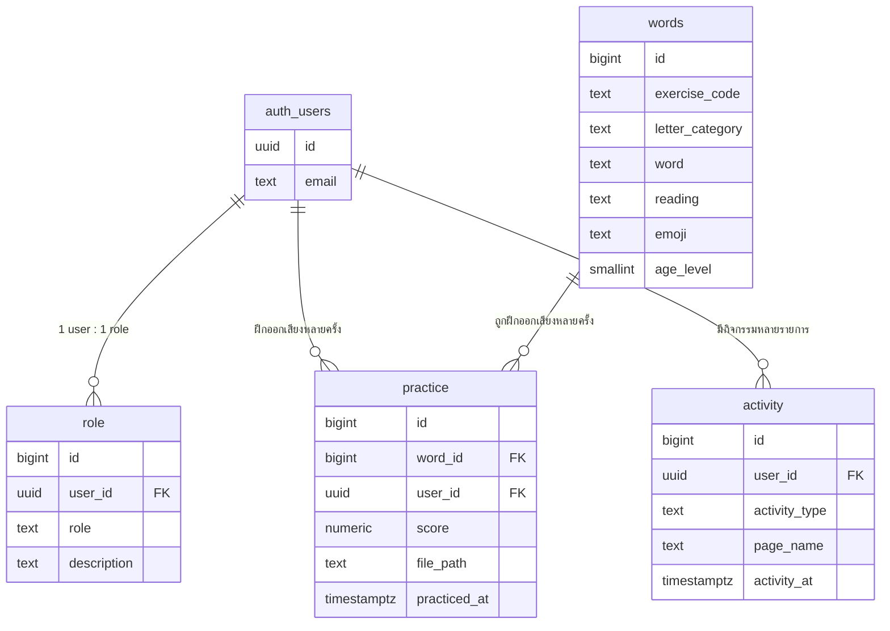

# ระบบเรียนรู้การออกเสียงด้วย AI (AI Pronunciation Learning System)

เว็บไซต์ฝึกออกเสียงภาษาไทยสำหรับเด็กที่มีปัญหาทางการออกเสียง (Speech Sound Disorders) อายุ 4-7 ปี ผู้ใช้งานฝึกออกเสียงคำสั้นๆผ่านแบบฝึกหัดและเกม บันทึกเสียงเก็บไว้ในระบบ และมีผู้เชี่ยวชาญ (นักแก้ไขการพูด) เข้ามาฟังไฟล์เสียงเพื่อให้คะแนนความถูกต้อง

> เว็บไซต์นี้จัดทำขึ้นเพื่อการศึกษาและฝึกฝนเบื้องต้นเท่านั้น ไม่ใช่เครื่องมือวินิจฉัยหรือทดแทนการรักษาทางการแพทย์

## ภาพรวมระบบ

| บทบาท | ขั้นตอนการใช้งาน |
|---|---|
| ผู้ฝึกออกเสียง (user) | ลงทะเบียน → เข้าสู่ระบบ → เลือกอายุ/แบบฝึกหัด หรือเล่นเกม → อัดเสียงฝึกออกเสียง (ระบบเก็บไฟล์เสียงอัตโนมัติ) → ดู report การฝึกของตนเองที่หน้า "การจัดการ" |
| ผู้เชี่ยวชาญ (specialist) | ลงทะเบียน → เข้าสู่ระบบ → เปิดหน้า "การจัดการ" → ฟังไฟล์เสียงของผู้ฝึกแต่ละคน (กรองรายคนได้) → ให้คะแนน → จัดการ (เพิ่ม/แก้/ลบ) คลังคำที่ใช้ฝึก |

หน้า `app.html` และ `game.html` เปิดดู/เล่นได้โดยไม่ต้อง login แต่การ "ฝึกออกเสียง" (บันทึกเสียง) ต้อง login ก่อนเสมอ

## หน้าเว็บไซต์

- **index.html** — หน้าหลัก, hero section
- **about.html** — ความสำคัญของการฝึกออกเสียง, ปัญหา/ความยากลำบากของเด็ก SSD, งานวิจัยอ้างอิง 3 รายการ (NIDCD, ASHA, Eadie et al. 2015)
- **contact.html** — โปรไฟล์ผู้จัดทำเว็บไซต์
- **app.html** — แบบฝึกหัดฝึกออกเสียงแบบลิสต์ แยกตามอายุ (4/5/6/7 ขวบ) และหมวดตัวอักษร แต่ละแบบฝึกหัดมีคำพร้อมปุ่มฟังตัวอย่างและปุ่มฝึกออกเสียง
- **game.html** — เกมผจญภัย 2D top-down (Phaser 3) เดินสำรวจหมู่บ้าน ชนของวิเศษเพื่อสุ่มคำฝึกออกเสียง
- **login.html** — เข้าสู่ระบบ / ลงทะเบียน (เลือกบทบาท user หรือ specialist)
- **management.html** — แดชบอร์ด: report การฝึก (user) หรือ จัดการคลังคำ + ให้คะแนนไฟล์เสียง (specialist)

## Tech Stack

- **Frontend**: HTML5, CSS3 (Bootstrap 5.3), Vanilla JavaScript (ไม่มี build step), Google Font "Prompt"
- **เกม**: [Phaser 3](https://phaser.io/) (โหลดผ่าน CDN) สำหรับ game.html
- **เสียง**: Web Audio API (คลื่นเสียงสด), MediaRecorder API (บันทึกเสียง), SpeechSynthesis API (ฟังตัวอย่างคำ)
- **Backend**: [Supabase](https://supabase.com/) (ฟรี tier) — PostgreSQL + Row Level Security, Auth (email/password), Storage (ไฟล์เสียง)
- **Hosting**: Static site บน GitHub (เช่น GitHub Pages)

## โครงสร้างโค้ด

```
index.html, about.html, contact.html      หน้าข้อมูลทั่วไป
app.html, game.html                       แบบฝึกหัด/เกมฝึกออกเสียง
login.html, management.html               auth + แดชบอร์ดตามบทบาท
css/style.css                             ธีมและสไตล์ร่วมทุกหน้า
js/config.js                              SUPABASE_URL / SUPABASE_ANON_KEY (ต้องกรอกเอง)
js/supabase-client.js                     สร้าง Supabase client (ตัวแปร sb) ใช้ร่วมทุกหน้า
js/auth.js                                session, role, nav auth-state, logActivity, requireLogin
js/words-api.js                           ดึงคำ/แบบฝึกหัดจาก Supabase
js/recorder.js                            บันทึกเสียง + วาดคลื่นเสียง + อัปโหลดเข้า Storage
js/speech.js                              เสียงพูดตัวอย่าง (SpeechSynthesis)
js/game-phaser.js                         ตัวเกม Phaser 3 (scene, ตัวละคร, ของวิเศษ)
js/main.js                                ไฮไลต์เมนูที่ใช้งานอยู่
supabase/schema.sql                       SQL สร้างตาราง + RLS policy + storage bucket ทั้งหมด
data/words.csv                            ข้อมูลคำฝึกออกเสียงสำหรับ import เข้าตาราง words
```

## ฐานข้อมูล (Supabase / PostgreSQL)

### ER Diagram



### ตาราง

- **words** — คลังคำฝึกออกเสียง 449 คำ แบ่งเป็น 21 หมวดเสียง (`exercise_code`): 16 หมวดพื้นฐาน (ก ข ค ง จ ช ด ต บ ป พ ม น ย ว ส) ที่ `age_level = 4` (เห็นได้ตั้งแต่อายุ 4 ขวบขึ้นไป) และ 5 หมวดยาก (ร, ล, และคำควบกล้ำ 3 กลุ่ม) ที่ `age_level = 6` (ปลดล็อกเพิ่มตอนอายุ 6-7 ขวบ) — แอป `app.html` ดึงคำที่ `age_level <= อายุที่เลือก` มาแสดง จึงทำให้อายุที่สูงกว่าเห็นทั้งหมวดง่ายและหมวดยากรวมกัน (ไม่ต้องสร้างข้อมูลซ้ำซ้อนต่ออายุ)
- **role** — บทบาทของผู้ใช้แต่ละคน (`user` หรือ `specialist`) ผูก 1:1 กับ `auth.users`
- **practice** — ทุกครั้งที่อัดเสียงฝึกออกเสียง 1 คำ จะมี 1 แถวที่นี่ พร้อม `file_path` ไปยังไฟล์ใน Storage และ `score` (เป็น `null` จนกว่า specialist จะให้คะแนน)
- **activity** — log การ login/logout และหน้าที่เข้าดู ของผู้ใช้แต่ละคน

### Row Level Security (RLS)

ทุกตารางเปิด RLS และมี policy ครบ select/insert/update/delete (ดูรายละเอียดทั้งหมดใน `supabase/schema.sql`) หลักการคือ:
- ใครก็อ่านคำใน `words` ได้ (ไม่ต้อง login ก็ browse แบบฝึกหัดได้) แต่แก้ไขได้เฉพาะ specialist
- แถวใน `role` / `practice` / `activity` ผู้ใช้เห็น/เพิ่มได้เฉพาะแถวของตัวเอง ส่วน specialist เห็นได้ทุกแถวและเป็นฝ่ายเดียวที่แก้ไข/ลบได้ (เช่น การให้คะแนน)
- ไฟล์เสียงใน Storage bucket `practice-audio` ใช้กฎเดียวกัน (เจ้าของไฟล์หรือ specialist เท่านั้นที่เข้าถึงได้) ผ่าน path convention `{user_id}/{ไฟล์}.webm`

ทั้งหมดใช้ฟังก์ชันช่วย `is_specialist(uid)` (security definer) เพื่อตรวจสอบบทบาทโดยไม่ชน RLS recursion

## วิธี Setup (ต้องทำเองเพราะต้องใช้บัญชี Supabase ของผู้ใช้)

1. สมัครและสร้างโปรเจกต์ใหม่ที่ [supabase.com](https://supabase.com) (free tier)
2. เปิด **SQL Editor** ในโปรเจกต์ แล้วรันไฟล์ `supabase/schema.sql` ทั้งไฟล์ (สร้างตาราง + policy + storage bucket ให้ครบในครั้งเดียว)
3. ไปที่ **Authentication > Providers > Email** แล้วปิด "Confirm email" (ให้ login ใช้งานได้ทันทีหลังลงทะเบียนตามที่สเปกต้องการ)
4. ไปที่ **Table Editor > words > Insert > Import data from CSV** แล้วเลือกไฟล์ `data/words.csv` เพื่อนำเข้าคลังคำ
5. ไปที่ **Project Settings > API** คัดลอก **Project URL** และ **anon public key** มาใส่ในไฟล์ `js/config.js`
6. เปิดเว็บไซต์ผ่าน local server (เช่น `python -m http.server`) หรือ deploy ขึ้น GitHub Pages แล้วทดสอบ: ลงทะเบียน 1 บัญชี user + 1 บัญชี specialist → ฝึกออกเสียงจาก user → ให้คะแนนจาก specialist → ดู report

**ข้อควรพิจารณาเพิ่มเติม:** ปัจจุบันหน้าลงทะเบียนให้ผู้ใช้เลือกบทบาท specialist ได้เองตามสเปก ซึ่งเหมาะกับการสาธิต/โปรเจกต์การศึกษา หากจะใช้งานจริงควรเปลี่ยนเป็นการอนุมัติบทบาท specialist โดยผู้ดูแลระบบแทน

## ข้อจำกัดทางเทคนิค

- `getUserMedia` (ไมโครโฟน) ต้องรันผ่าน `localhost` หรือ HTTPS เท่านั้น เปิดไฟล์ตรงแบบ `file://` จะใช้ไมโครโฟนไม่ได้
- เบราว์เซอร์ที่แนะนำ: Chrome หรือ Edge (รองรับ Web Speech/Media API ครบที่สุด)
